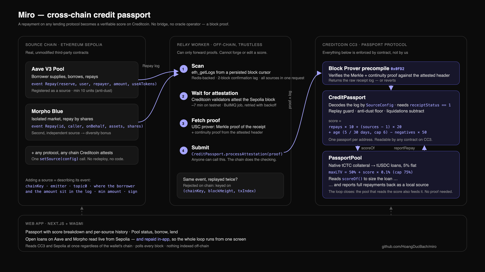

# Miro

A portable credit passport. Repayments made on real lending protocols on one chain are
proven onto Creditcoin and become credit a lender on another chain can actually read.

No bridge moves funds. No oracle operator signs anything. The proof is cryptographic, and
it is verified on-chain by Creditcoin's Block Prover Precompile.

> BUIDL CTC 2026 Fall — DeFi Track.
> [Product spec](docs/product-spec.md) · [Technical spec](docs/technical-spec.md) ·
> [Attestcoin integration](docs/attestcoin-integration.md)

## The problem

Repayment history is trapped on the chain where it was earned. No lender elsewhere can
verify it without trusting a bridge or an oracle. So every loan starts from zero, and DeFi
falls back on over-collateralization: good borrowers pay for bad ones.

## How it works



1. A borrower repays a loan on **Aave V3** or **Morpho Blue** — real, unmodified protocols
   on Ethereum Sepolia. Miro is not involved and asks nothing of anyone.
2. A worker sees the `Repay` event, waits for the source block to be attested, fetches a
   Merkle and continuity proof, and submits it to Creditcoin.
3. **CreditPassport** verifies the proof on-chain and records the repayment. The score is
   deterministic: repayments counted, source diversity, passport age, minus negative
   events. No oracle, no discretion.
4. **PassportPool**, a reference lender on Creditcoin, reads that score and raises the
   borrower's loan-to-value ceiling from a 50% base toward a hard 75% cap. It reports its
   own full repayments back into the same passport it reads from.

Sources are configuration, not code. Registering a new protocol or a new source chain is
one `setSource` call describing where the borrower and amount sit in that event's log.

## Proof it runs

One wallet, one passport, three independent sources — a real run against live testnets:

| Step | Score | Max LTV |
|---|---|---|
| Local repayment on PassportPool | 10 | 51% |
| Repay on Aave V3, proven cross-chain | 40 | — |
| Repay on Morpho Blue, proven cross-chain | 70 | — |
| Second local repayment | 80 | 58% |

The same 1,000 tCTC of collateral backed a $500 credit line at score 0 and $580 at score
80. The collateral did not change; the terms did.

The two cross-chain proofs, verified on CC3 Testnet:

- Aave `Repay` — `0x85ac6ad9c60b8b8b25d896eb1f62486b820747637af3232b956ddad869e20281`
- Morpho `Repay` — `0x1ec083c125b85b4b1ef985051fececae3c2d0dc92765f52af9a67c1188da0d39`

Deployed on CC3 Testnet (chain `102031`):

| Contract | Address |
|---|---|
| CreditPassport | `0xF7F1E82CFA97d07812D8a61DD4c05B1C228f5851` |
| PassportPool | `0x027a17E704B5641e6b2525415265133190b47FdB` |
| TestUSDC | `0xc2706681eC25d9823882A7f80040579501d9bc16` |
| PriceOracle | `0x78c46a57fc1c8d60570d48BFc1BBC8f490669c50` |

Reproduce the whole path with `pnpm worker:e2e`.

## Layout

```
contracts/creditcoin   CreditPassport, PassportPool, TestUSDC, oracle (CC3 Testnet)
contracts/source       Demo assets to bootstrap a Morpho market (Sepolia)
apps/worker            Event listener, proof pipeline, submitter
apps/web               Next.js dashboard: passport, borrowing, lending
packages/shared        ABIs, addresses, event topics
docs                   Specs, integration writeup, demo script
```

Aave V3 and Morpho Blue are not in this repo. They are real deployments, used unmodified —
proving external repayment behaviour is the point, not reimplementing lending.

## Setup

Needs Node 20+, pnpm 9+, [Foundry](https://getfoundry.sh), and [Bun](https://bun.com) for
the worker.

```bash
pnpm install
cp .env.example .env          # RPC URLs, keys, deployed addresses

# Each contracts/ directory is an independent Foundry project.
forge install foundry-rs/forge-std --no-git --root contracts/creditcoin
forge install OpenZeppelin/openzeppelin-contracts@v5.7.0 --no-git --root contracts/creditcoin
forge test --root contracts/creditcoin
```

```bash
pnpm web           # dashboard
pnpm worker        # relay Aave and Morpho repayments
pnpm worker:e2e    # full end-to-end run
pnpm test          # worker and web suites
```

Deployment commands, including why `forge script` needs replacing with `forge create` on
CC3 Testnet, are in [docs/attestcoin-integration.md](docs/attestcoin-integration.md).

## Limits

- **Sybil resistance is partial.** Cycling borrow-repay to farm score costs real gas and
  interest, a per-source cap stops one protocol paying after ten counted repayments, and
  only full repayments above a floor are reported. It is not eliminated, and this is the
  largest un-mitigated risk in the design.
- **No identity binding.** A borrower can abandon a wallet and start fresh. Self-limiting
  rather than exploitable: a new wallet gets base terms.
- **One source chain today.** CC3 Testnet attests Sepolia only. `chainKey` is resolved at
  runtime and never hardcoded, so a second chain is configuration — but it is a present
  limitation, not a solved problem.
- **No liquidation engine.** Every position stays over-collateralized and LTV is capped at
  75%, which is what makes that omission survivable at this stage.

The full trust model is in
[docs/product-spec.md §1.6](docs/product-spec.md#16-trust--risk-model-state-honestly-in-submission).
